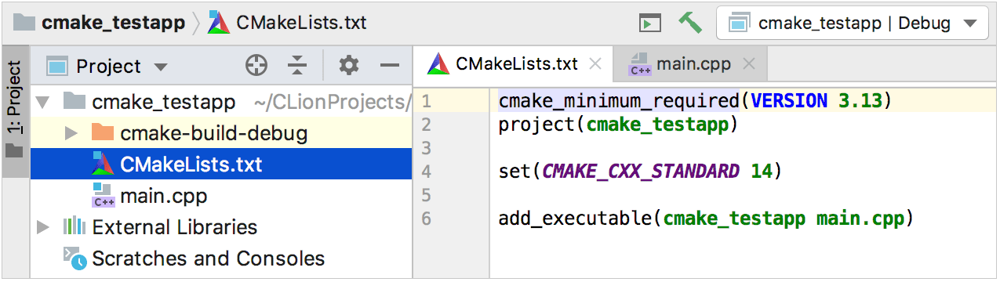
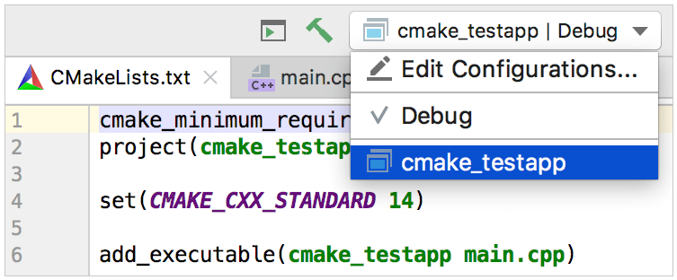
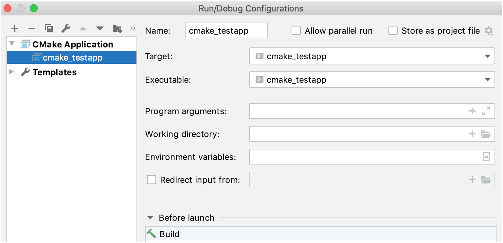

# CMake快速入门教程

这篇教程会通过一个简单的CMake项目的创建和开发过程来指导你。我们将会一步步地学习CMake作为构建系统的基本知识，以及Cmake项目在CLion中的设置和操作。

> 下面使用的示例项目源代码可以在[Github](https://github.com/MarinaKalashina/CMake-Tutorial-sample)上找到。

## 1. 基本CMake项目

CMake是一种基元构建系统，使用称为**CMakeList**的脚本生成特定环境下的生成文件（build files），比如说在Unix设备中的makefiles。当你在CLion中创建一个新的CMake项目时，**CMakeLists.txt**文件将在项目根目录下自动生成。

让我们开始创建一个新的CMake项目吧。首先，请转至**File|New Project**并且选择**C++可执行**。以本教程为例，项目名称为*cmake_testapp*，所选语言标准*为C++14。*

默认情况下，CLion使用单个源文件**main.cpp**，并且自动创建的根目录下的**CMakelLists.txt**包含以下命令：

| 命令                                   | 描述                                                         |
| -------------------------------------- | ------------------------------------------------------------ |
| cmake_minimum_required(VERSION 3.13)   | 指定CMake的最低要求版本，在这里被设置为CLion内置的CMake版本（始终是最新版本之一） |
| project(cmake_testapp)                 | 根据在项目创建过程中提供的内容来定义项目名称                 |
| set(CMAKE_CXX_STANDARD 14)             | 将*CMAKE_CXX_STANDARD*设置为14，和在创建项目时选择的C++标准一样 |
| add_executable(cmake_testapp main.cpp) | 构建可执行文件*cmake_testapp*时将从**main.cpp**生成          |

## 2. 生成目标产物和运行/调试配置

目标产物（Target）是使用CMake脚本构建的可执行文件或库文件，你可以在单步脚本中定义多个生成目标。

目前，这个测试项目中只有一个生成目标*cmake_testapp*。在第一个项目加载时，CLion会自动添加与此目标相关的运行/调试配置。

单击切换器中的**Edit Configurations**或者选择主菜单中的**Run | Edit Configurations**以查看细节。目标（Target）的名称和可执行文件（executable）的名称从**CMakeLists.txt**中直接获得。

请注意此对话框中的“Before launch"区域：默认情况下，将构建（build）设置为启动前的步骤。因此我们不仅可以使用此配置来调试或运行目标，还可以执行构建。

