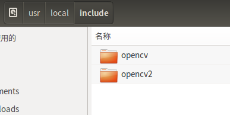
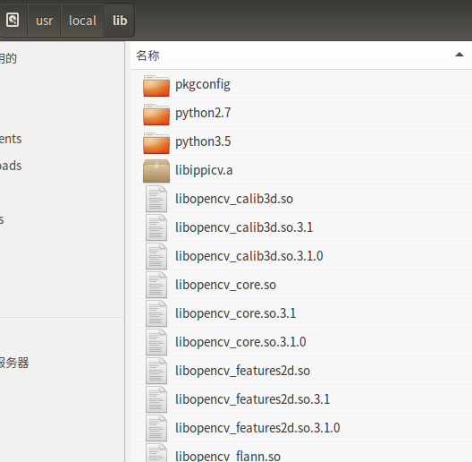

# OpenCV的安装

## 安装依赖

```
sudo apt-get install build-essential
sudo apt-get install cmake git libgtk2.0-dev pkg-config libavcodec-dev libavformat-dev libswscale-dev
sudo apt-get install python-dev python-numpy libtbb2 libtbb-dev libjpeg-dev libpng-dev libtiff-dev libjasper-dev libdc1394-22-dev
```

## 安装ffmpeg

这里有一个大坑，当我第一次完全配置好后，在调试时发现根本无法读取AVI视频文件，而调用摄像头是正常的。原因就是没有提前安装ffmpeg。如果你也有处理视频的需要，那么最好在这步提前安装一下。

```
git clone https://git.ffmpeg.org/ffmpeg.git ffmpeg
cd source_directory
./configure --enable-shared --disable-static --prefix=/usr/local/ffmpeg //自己想要存放的地方
make
sudo make install
```

检查是否安装成功

```
ffmpeg -version
```

## 下载源码压缩包

有大神搭建了一个国内镜像网站[庐雪技术博客](https://www.bzblog.online/wordpress/index.php/2020/03/09/opencvdownload/)，下载速度很快，选择一个版本下载（如opencv-3.1.0.zip）

## 编译和安装

解压源码压缩包

```
cd opencv    #进入opencv根目录
mkdir build    #创建编译输出目录
cd build    #进入build 目录
#编译（注意cmake最后需要写两个点）
sudo cmake -DCMAKE_BUILD_TYPE=RELEASE -DCMAKE_INSTALL_PREFIX=/usr/local -D WITH_FFMPEG=ON ..
sudo make
sudo make install
```

在sudo cmke结束后，输出中如果这几项是YES，那么说明ffmpeg安装没有问题。

```
FFMPEG:                      YES
      avcodec:                   YES (ver 56.60.100)
      avformat:                  YES (ver 56.40.101)
      avutil:                    YES (ver 54.31.100)
      swscale:                   YES (ver 3.1.101)
      avresample:                YES (ver 2.1.0)
```

当出现Configure done和Generate done时，说明opencv已经安装完毕，现在你可以检查一下文件夹```/usr/local/include```和```/usr/local/lib```这里是共享库的位置。



**这里应该有opencv和opencv2的文件夹**



**这里会有很多的.so文件**

如果你对命令行陌生，那么你可以通过```apt install cmake-gui```安装图形界面的cmake进行编译安装。

# 在QT中使用opencv

在.pro文件中添加以下语句，以便你的程序可以正常调用opencv库。

```
INCLUDEPATH +=  /usr/local/include \
                /usr/local/include/opencv \
                /usr/local/include/opencv2

LIBS += /usr/local/lib/libopencv_*.so\
        /usr/local/lib/libopencv_*.so.3.1\
        /usr/local/lib/libopencv_*.so.3.1.0\
```

