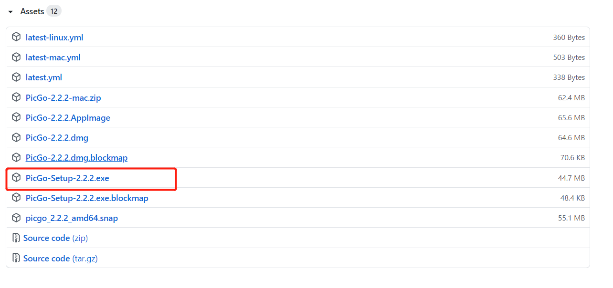
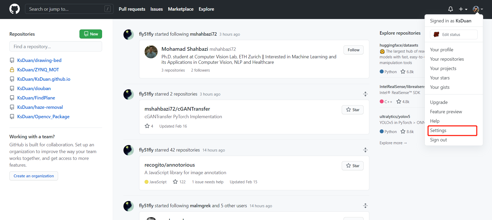
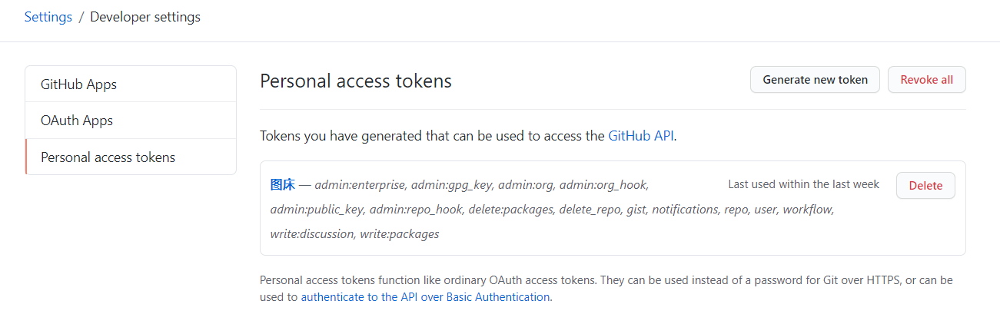
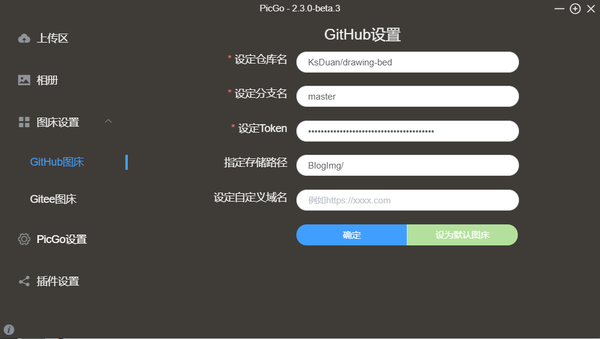

# Picgo+github创建自己的图床

> 虽然市面上有很多的云服务器产品，可以拿来做图床，但大多是付费的，免费的又担心跑路。综合考量后，GitHub可能是最适合我这种小博客用户使用。
>
> 优点：
> 1. 完全免费，不担心跑路；
> 2. 不需要注册其他账号；
> 3. 配置简单（本文内容）
>
> 缺点：
> 1. 上传图片慢...
> 2. 国内访问慢...

# 1. Picgo

在[Github](https://github.com/Molunerfinn/PicGo/releases)页面下载Picgo，选一个稳定版就行。

# 2. 创建GitHub仓库

在GitHub创建一个公开仓库，方法不表。

点击右上角头像，进入setting页面：

在页面最新下找到 `Developer settings`，点击进入；

创建token，输入密码后，复制生成的token，这个密令只出现一次，记得及时保存。忘记了重新生成就好。

# 3. 配置图床

* 设定仓库名

  从你的仓库页面可以看到，不要有空格；

* 设定分支名

  填` master `就行
  
* 设定token

  填入复制的密令
  
* 指定存储路径

  可填可不填

