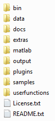
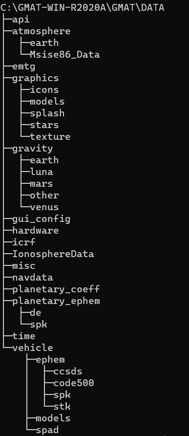
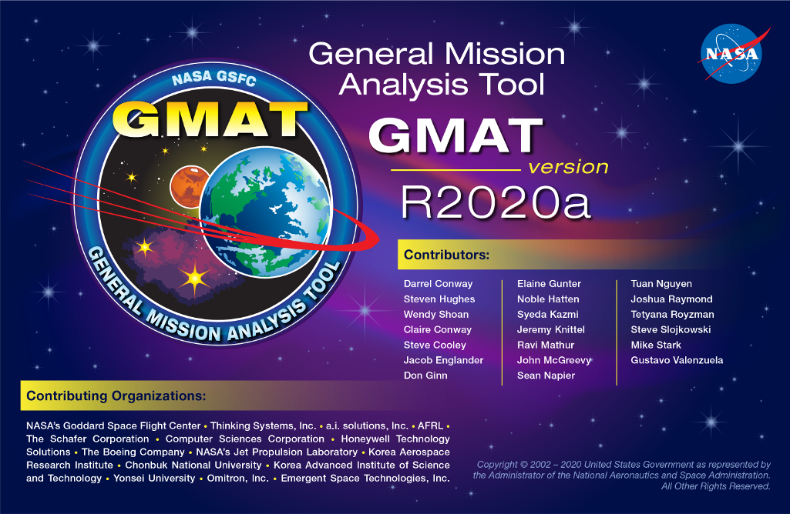
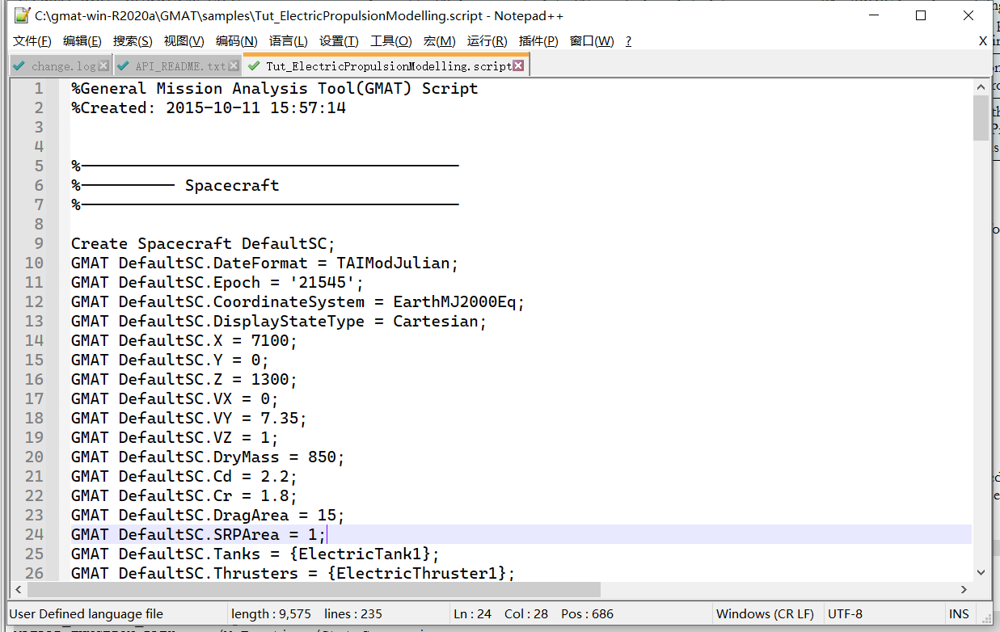
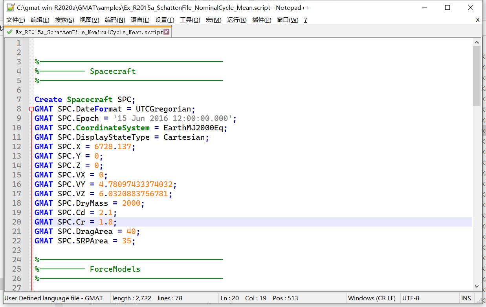
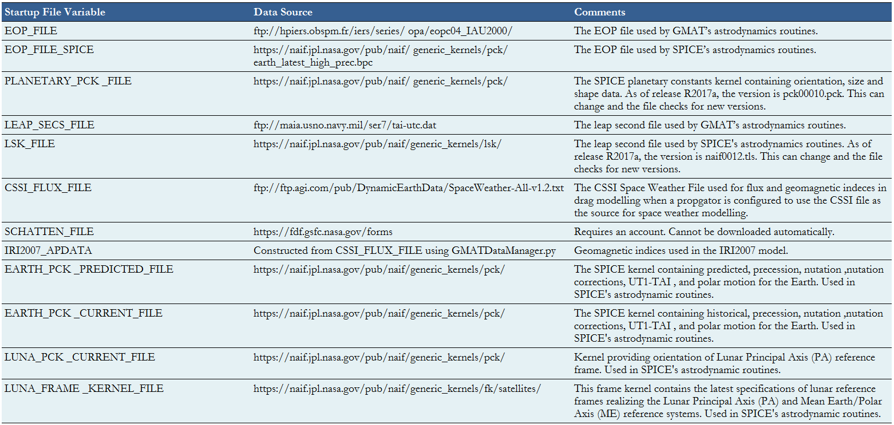

# GMAT的各目录和文件及其含义

GMAT内的文件和数据全部在安装文件夹下，有些是运行GMAT所必须的。GMAT使用了很多类型的数据文件，包括行星星历文件、地球方位数据、闰秒文件，以及重力系数文件等。这篇文章介绍了GMAT软件的目录和文件，以及它们的作用。

## 文件结构

GMAT的默认目录结构分为八个主要子目录，如下图所示。这些目录包含了用于运行GMAT的文件和数据，包括二进制库、数据文件、纹理贴图和3D模型。在GMAT的根目录下只有两个文件：```license.txt```（Apache 2.0许可证文件）和```README.txt```（包含当前GMAT版本的用户信息）。



以下几个小节介绍了各个文件夹的内容和作用。

### bin

***bin***文件夹包含GAMT核心功能所需的所有二进制文件，包含可执行文件（Win下是GMAT.exe，MACOS下是GMAT.app，Linux下是GMAT）和各个平台的支持库。***bin***文件夹下还有两个文本文件：```gmat_startup_file.txt```和```gmat.ini```。startup是启动文件，```gmat.in```文件用于配置GUI面板，设置外部web链接的路径以及定义GUI工具提示消息。

> Note
>
> 在MAC上安装GMAT时需要一些额外的步骤来处理“translocation”，这是因为GMAT使用GCC而不是Apple tools构建。

### data

***data***目录包括运行GMAT所必需的所有数据文件，依照数据类型分类，如图所示。



- ```graphics```目录包含GMAT可视化程序的数据文件，以及应用程序的图标和图像。其中：```splash```目录包含GMAT初始屏幕，该屏幕在GMAT初始化时短暂显示，如下图所示；```stars```目录包含用于3D显示星星的数据文件；```texture```目录包含用于2D和3D图形资源的纹理贴图；```icons```目录包含用于在运行时加载的图标和图像文件。

  

- ```gravity```目录包含了各个星体默认非球形重力模型的重力系数文件。在每个目录下，重力系数文件根据其表示的模型命名，拓展名为```.conf```。
- ```gui_config```目录包含了一些用于配置GMAT资源和命令的GUI对话框文件，这些文件被一些软件内置的GUI面板使用，也可以用于创建新的GUI面板。
- ```planetray_coeff```目录包含由国际地球自转服务组织（IERS）提供的地球方位参数（EOP）和不同章动理论的章动系数。
- ```planetary_ephem```目录包含DE和SPK格式的行星星历数据。```de```目录下是DE405星历表，包含由JPL维护的8大行星、月球和冥王星；```spk```目录下是DE421星历表，包含彗星、小行星和卫星。和GMAT一起发行的所有星历文件均采用little-endian格式。
- ```time```目录包括JPL闰秒表```naif0010.tls```和GMAT闰秒表```tai-utc.dat```。
- ```vehicle```目录包含所选航天器的星历数据和3D模型，```ephem```目录包含SPK星历文件，包括轨道、姿态、帧和时间。```models```目录包含3DS或POV格式的3D模型，用于GMAT的轨道可视化。

### docs

***docs***目录下为用户文档，包括数学规范、体系结构规范和估算规范，格式为PDF、HTML、Windows Help。

### extras

***extras***目录下包含各种额外的文件，这些文件对于使用GMAT很有帮助，但不是核心代码的一部分。目前这个目录下唯一的文件是GMAT脚本语言的语法着色文件，可以导入Notepad++中使用。

↓在Notepad++中未使用着色文件↓


↓在Notepad++中使用着色文件↓

### matlab

***matlab***目录下包含GMAT的MATLAB接口（包括与fmincon优化器的接口）所需的.M文件。为了正常使用MATLAB的接口，***matlab***目录及其子目录下的所有文件必须添加至MATLAB的路径。

### output

***output***目录是文件输出（如星历文件和报告文件）的默认位置，如果没有为输出文件提供路径信息，则文件将保存至此目录下。

### plugins

***plugins***目录包含GMAT不必需的可选插件。```proprietary```目录用于放置一些无法自由发布的第三方库，在开源发布版本中这是一个空文件夹。

### samples

***samples***目录包含示例任务和脚本，示例文件以```Ex_```开头，对应于GMAT教程文件以```Tut_```开头。这些文件旨在演示GMAT的功能，入门学习使用。

### userfunctions

***userfuncions***目录包含GMAT发行版中包含的MATLAB、python和GMAT函数，还可以将用户的自定义函数保存在这里。GMAT在运行时将在这些子目录下搜索对性的函数。

## 配置数据文件

GMAT中使用了很多定期更新的数据文件，在某些情况下，这些文件由所属组织每3小时更新一次。GMAT内置Python脚本```\utilities\python\GMATDataFileManager.py```，可以自动执行文件更新，记录更改并且可以选择将旧版本的数据文件存档。

下面描述了GMAT中使用的实际数据类型，包括它们在startup文件中的引用变量、数据文件的来源以及如何获取它们。




### 加载自定义插件

通过在启动文件```bin/gmat_startup_file.txt```中添加一行，可以指定插件的名称和位置，从而加载自定义插件。为了使插件可以和GMAT一起使用，必须将插件放在启动文件引用的目录下。具体可参阅```\docs\help\html\StartupFile.html```。

### 配置matlab接口

参阅```\docs\help\html\MatlabInterface.html```

### 配置python接口

参阅```\docs\help\html\PythonInterface.html```。

### 用户自定义功能路径

- 将用户自行编写的matlab文件```.m```放在```userfunctions/matlab```目录下；

- 在启动文件中添加搜索一个或多个路径，方法如下。GMAT将按照启动文件中指定的顺序搜索路径，并将使用匹配到的第一个函数。

  ```
  MATLAB_FUNCTION_PATH = ../MyFunctions/utils
  MATLAB_FUNCTION_PATH = ../MyFunctions/StateConversion 
  MATLAB_FUNCTION_PATH = ../MyFunctions/TimeConversion
  ```
